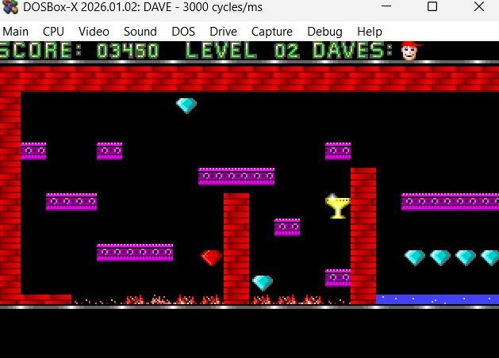
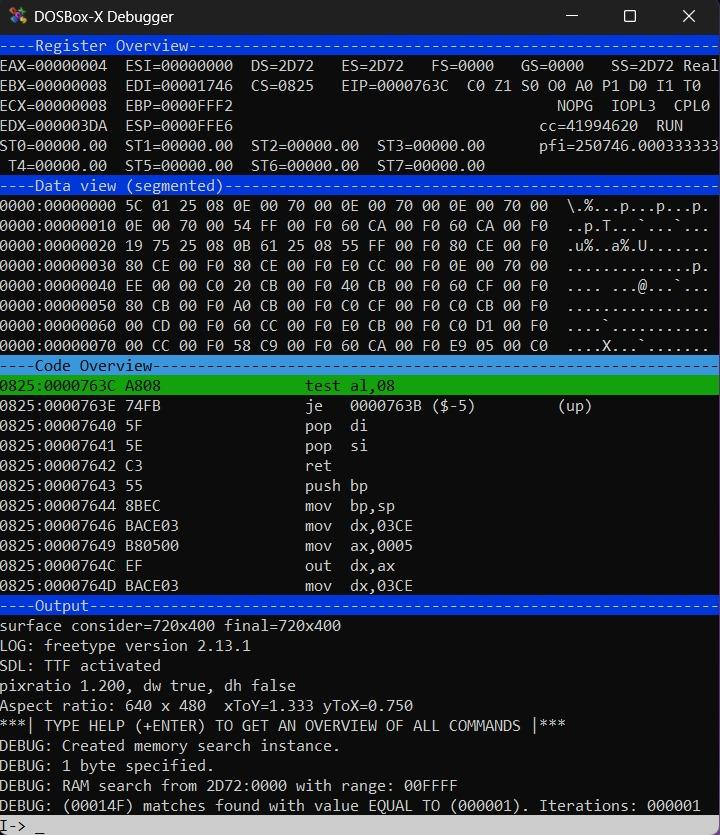
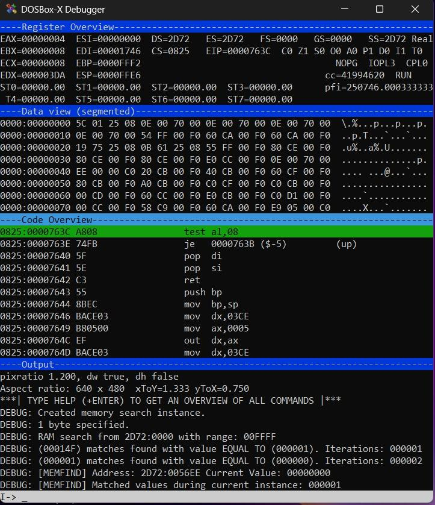
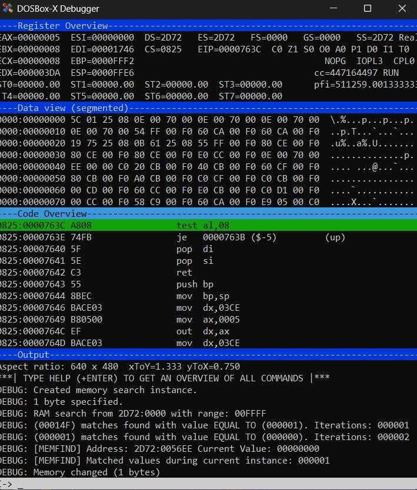
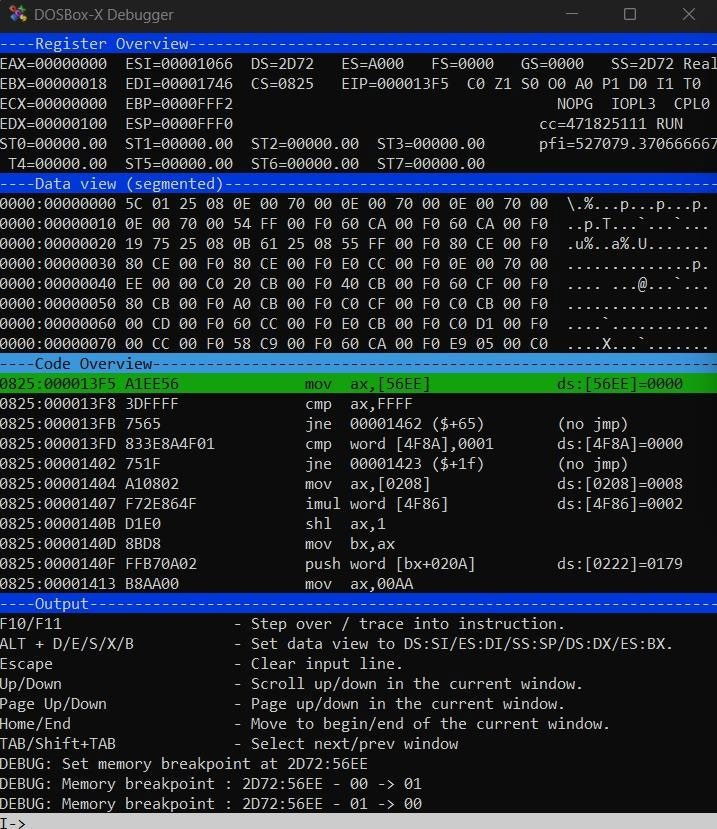
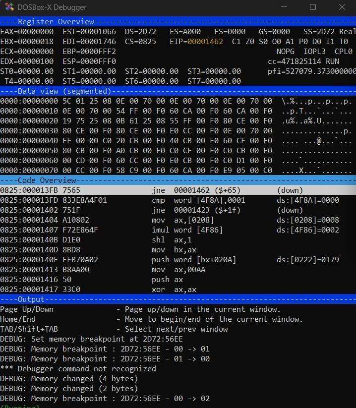
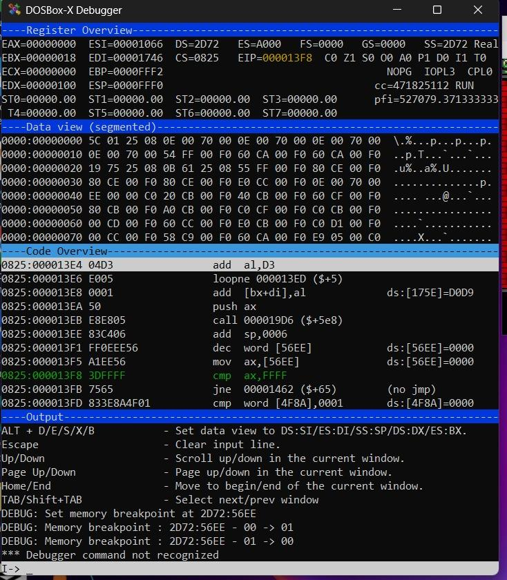
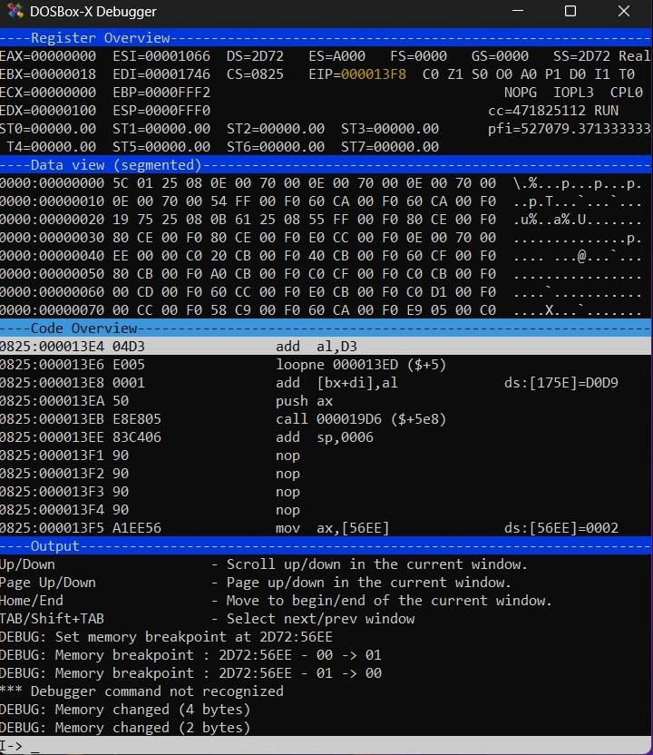
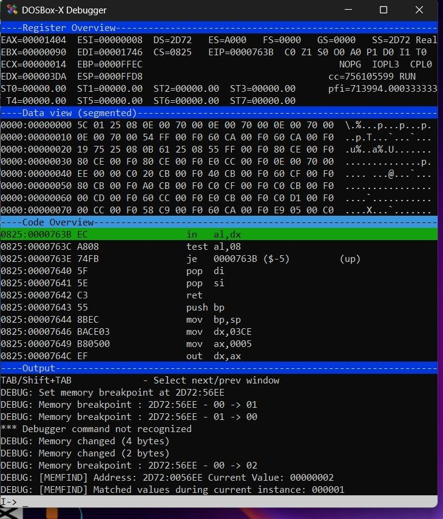
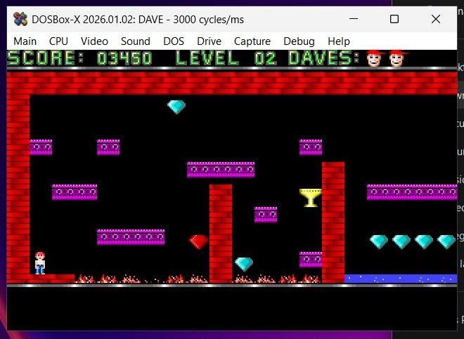

# Reverse Engineering and Runtime Manipulation of Dangerous Dave (1990 DOS)

Dynamic and static analysis of the classic DOS platformer **Dangerous Dave**, locating the player's "lives" variable in live memory, tracing the exact instruction that modifies it, and patching that instruction at runtime to disable life loss.

## 1. Environment

| Component | Detail |
|---|---|
| Target | Dangerous Dave (1990 DOS version) |
| Execution platform | DOSBox-X on Windows |
| Debugger/disassembler | DOSBox-X built-in debugger |
| Sandbox | Local, offline DOS emulation |

Dangerous Dave was chosen because its life counter (`DAVES`) is visible directly on the HUD and updates predictably on death, making it a clean target for memory-diffing.

```
mount c "<game-folder-path>"
c:
dir dave
```

The debugger was attached once the game was confirmed running.



---

## 2. Locating the Lives Variable

**Observation.** The `DAVES` counter visibly decreases on death, confirming the value lives somewhere in the data segment. The runtime registers showed `DS = 2D72`.

**Search strategy** — classic memory-diffing:
1. Snapshot all memory matching the current value.
2. Trigger the change (kill Dave).
3. Re-filter candidates against the new value.
4. Repeat until one address remains.

```
memfind 2d72:0000 ffff b
mems 01
run
```
*(kill Dave — value drops from 1 → 0)*
```
mems 00
```




The filter converged to a single candidate:

```
memfind l
```

**Result:** `2D72:0056EE`, holding `00000000` — matching the on-screen "0 lives" state. Manually editing this address restored lives in-game, confirming the address.



---

## 3. Static Analysis

With the address confirmed, a memory breakpoint traps any write to it:

```
bpm 2d72:0056ee
```

Killing Dave again triggered the breakpoint:

```
DEBUG: Memory breakpoint : 2D72:56EE - 01 -> 00
```

Disassembly around the trap:

```asm
mov ax,[56EE]
cmp ax,FFFF
```

confirming the routine both reads and updates the same variable.




Stepping back through the disassembly located the exact decrement:

```asm
0825:000013F1   dec word [56EE]
```

This is the single instruction responsible for the life count dropping by one on every death.



---

## 4. Runtime Patch

The decrement was overwritten in memory with four `NOP` (`0x90`) bytes — a no-op — so execution reaches that address and simply falls through:

```
sm 0825:013f1 90 90 90 90
```

```
dec word [56EE]      →      nop
                             nop
                             nop
                             nop
```



**Verification.** Lives were reset for a clean test:

```
sm 2d72:0056ee 02 00
```
```
ds:[56EE] = 0002
```

Dave was killed again post-patch — the value held at `00000002`, confirming lives no longer decrease.




---

## 5. Security Analysis

### Why this was possible
Dangerous Dave is representative of legacy software with no modern hardening:
- **No anti-debugging** — the process could be paused, stepped, and inspected freely.
- **No integrity checking** — patching four bytes of executable code triggered no checksum or signature failure.
- **Plaintext critical state** — the lives counter sat in memory as a raw, unvalidated integer.
- **No obfuscation** — the decrement instruction was immediately legible in disassembly.

### Mitigations a modern build could apply
| Control | Effect |
|---|---|
| Anti-debugging | Detect breakpoints/debugger presence and respond (terminate, hide code paths) |
| Integrity checking | Hash/checksum critical code so runtime patches are detected |
| Obfuscation / packing | Raise the cost of locating meaningful instructions |
| State hardening | Encode or split critical variables, cross-check redundant copies |
| Tamper-aware design | Verify state transitions independently across routines |
| Server-side authority | Keep critical values on a trusted remote system, not the client |


## Disclaimer

This project is an educational reverse-engineering exercise performed offline against 1990 abandonware for coursework purposes. No online, licensed, or actively-sold software was targeted.
